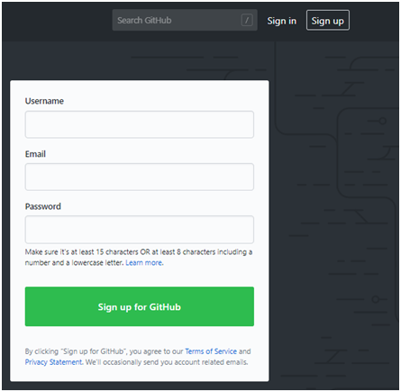
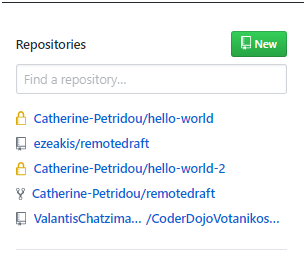
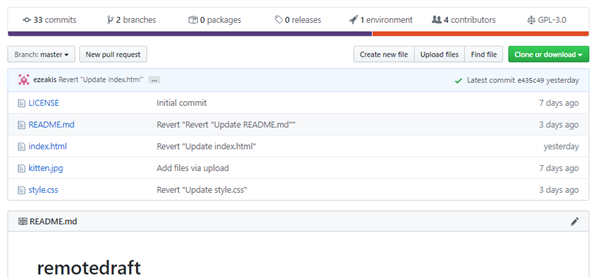
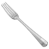
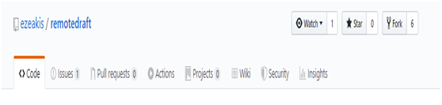
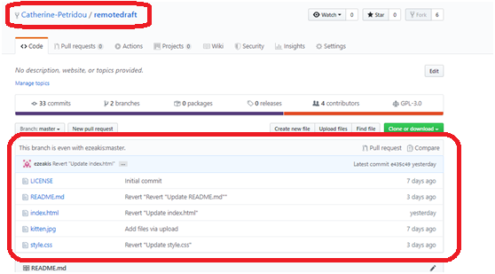

# Εισαγωγή στο Github

## Πως μπαίνω στον λογαριασμό GitHub;

 Μπαίνω στη σελίδα https://github.com
 

   Πατάω sign in

 

   Συμπληρώνω το mail μου, τον κωδικό μου και πατάω sign in!!!

 
Μόλις μπούμε μέσα στην σελίδα μας , πάνω αριστερά θα δούμε το όνομα μας καθώς και τα repositories της ομάδας.
Για να μπούμε στο repository πάνω στο οποίο θα δουλέψουμε είναι το ezeakis/remotedraft, και πατάμε πάνω σε αυτό!!!
 

 
Η σελίδα στην οποία θα μεταφερθούμε θα είναι κάπως έτσι!

## Πως μπορώ να αντιγράψω το περιεχόμενο της σελίδας;

Θέλετε να κάνετε αυτή την σελίδα δική σας;
Εύκολο!
Αν είχαμε ένα πιάτο με λαχταριστές τηγανιτές πατάτες τι θα χρειαζόμασταν για να τις τσιμπήσουμε ;
Όοοχι με το χεράκι!
 

Μα φυσικά ένα πιρούνι (fork)!

                                   
Πάμε να το κάνουμε!
Πατάμε το κουμπάκι fork

 
Μόλις το κάνουμε, μεταφερόμαστε στην σελίδα μας όπου βλέπουμε το αντίγραφο που μόλις δημιουργήσαμε…
 

