# Ενεργοποίηση και επεξεργασία ιστοσελίδας στο GitHub

# Ενεργοποίηση ιστοσελίδας

Έχουμε λοιπόν δημιουργήσει ένα αντίγραφο μιας ιστοσελίδας στο δικό μας λογαριασμό

Για να την ενεργοποιήσουμε πατάμε "Settings"

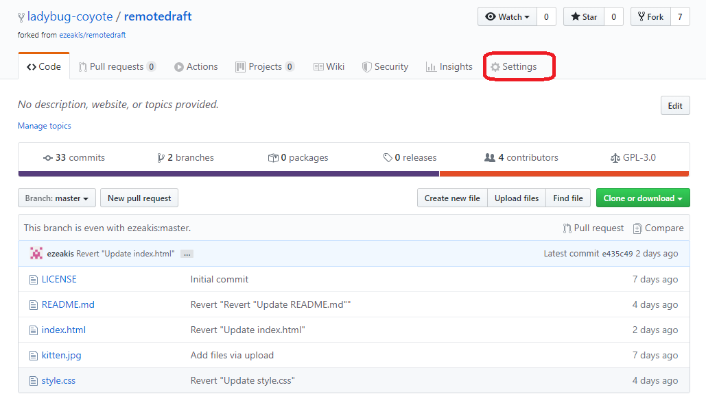

Κατεβαίνουμε πιο κάτω και στην ενότητα "Github Pages", στο "Source",  επιλέγουμε αντί για το "None" το "Master"

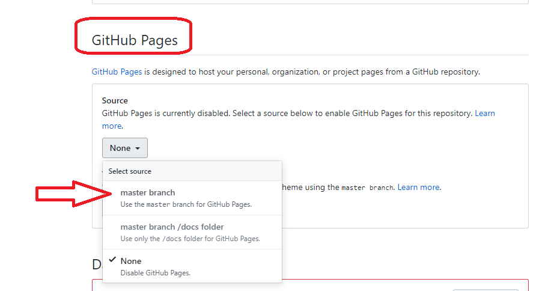

Κατόπιν επιστρέφουμε στον κώδικά μας πατώντας "Code"

Παρατηρούμε ότι πλέον υπάρχει η επιλογή "Environment". Την πατάμε.

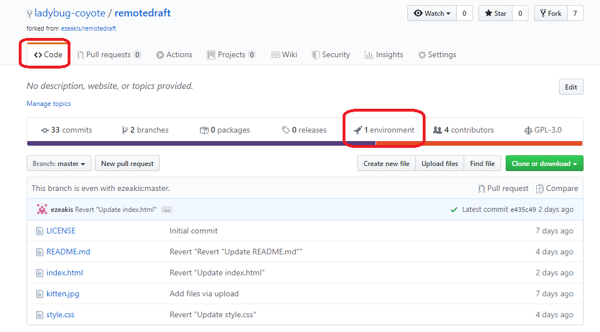

Πατάμε το πιο πρόσφατο "View Deployment"

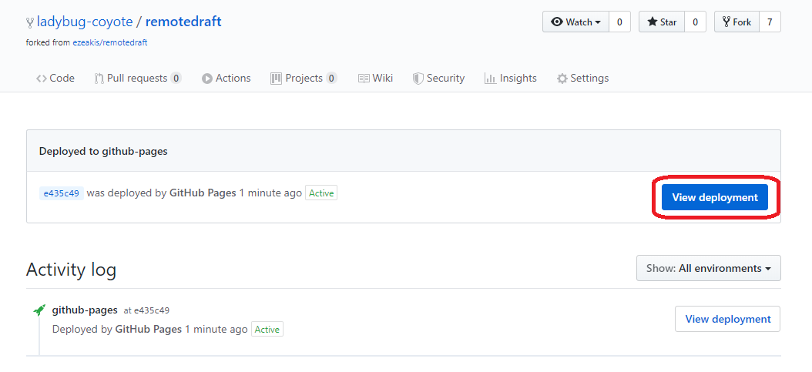

Θα μας ανοίξει μία νέα καρτέλα. Αυτή είναι η ιστοσελίδα μας!

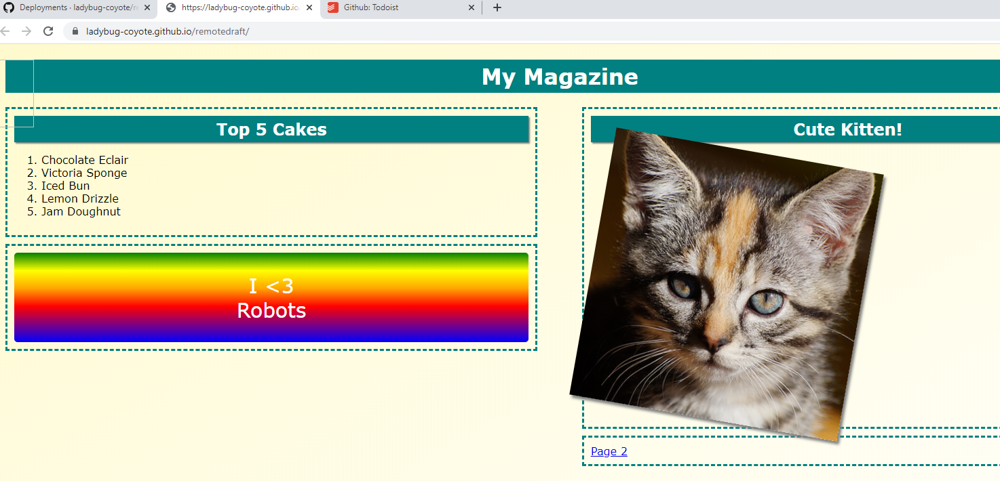

Πρόσεξε στο αριστερό μέρος ότι αναφέρεται μία λίστα γλυκών, με το πρώτο να είναι το Chocolate Eclair. Θα μας χρειαστεί παρακάτω.

Είναι διαθέσιμη κανονικά σε οποιονδήποτε

Για να την στείλουμε σε κάποιον άλλο να την δει, χρησιμοποιούμε τον σύνδεσμο

# Επεξεργασία Ιστοσελίδας

Με τις προηγούμενες ενέργειες έχουν ανοίξει δύο καρτέλες.

Η αριστερή είναι αυτή που γράφουμε τον κώδικα και στη δεξιά εμφανίζεται η σελίδα μας.

Επιστρέφουμε στην αριστερή καρτέλα

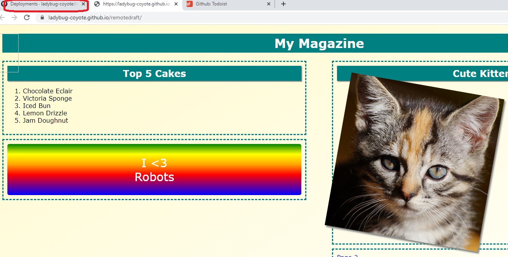

Επιστρέφουμε στον κώδικα πατώντας "Code".

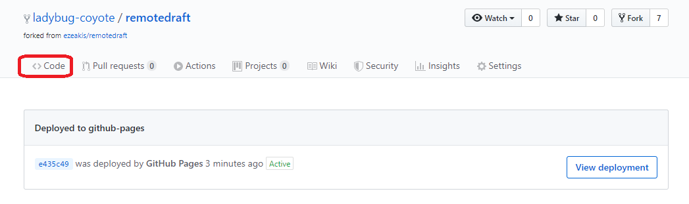

Τα τρία αρχεία με τα οποία μπορούμε να επεξεργαστούμε τη συγκεκριμένη ιστοσελίδα είναι τα index.html, style.css και kitten.jpg

Πατάμε το index.html

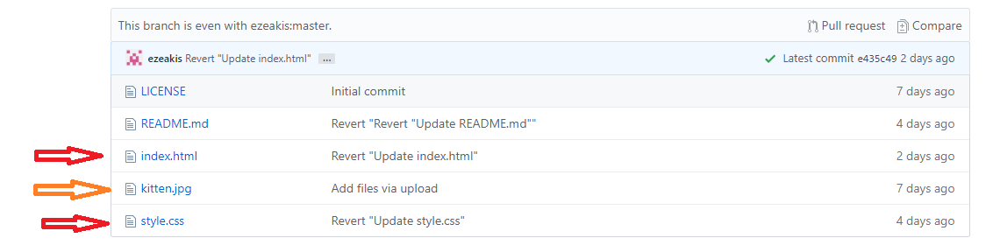

Εντοπίζουμε το "Chocolate Eclair" που είχαμε δει στην ιστοσελίδα. Αυτό θα αλλάξουμε.

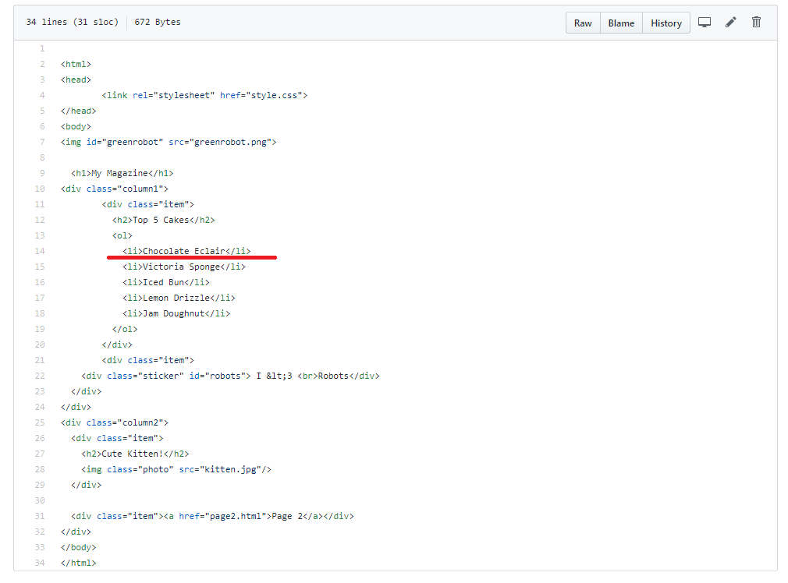

Πατάμε το μολύβι πάνω δεξιά για να επεξεργαστούμε το αρχείο

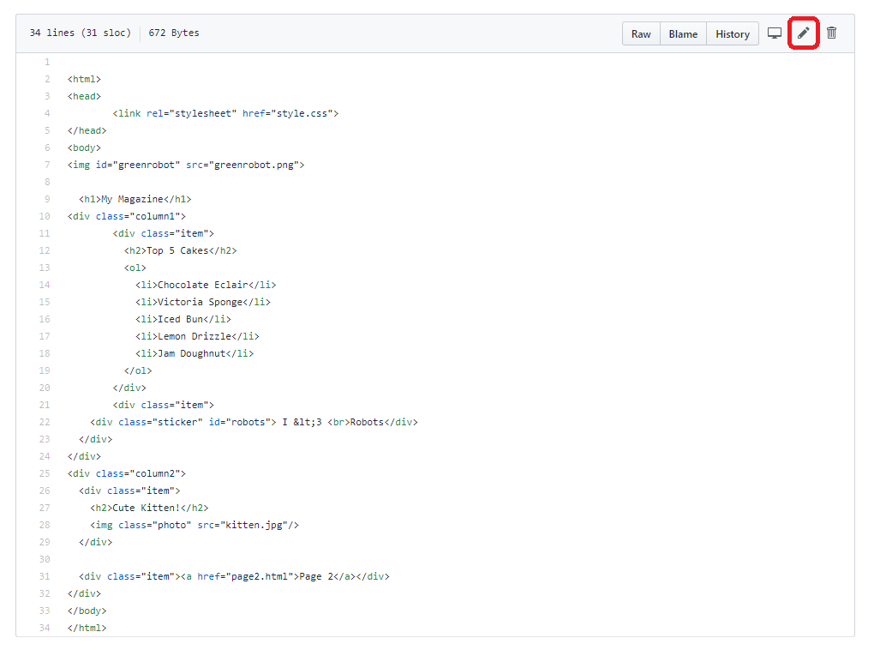

Αλλάζουμε το "Chocolate Eclair" σε ό,τι θέλουμε, πχ "Σοκολατόπιτα".

Προσέχουμε να αλλάξουμε μόνο το κείμενο και όχι τα tags li που είναι δεξιά και αριστερά του

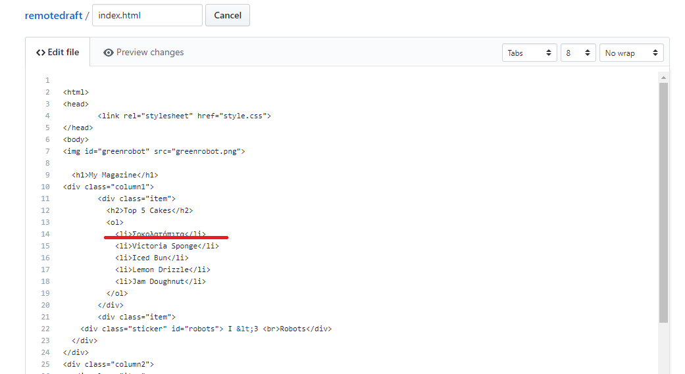

Πάμε πιο κάτω στη σελίδα και πατάμε "Commit Changes" για να οριστικοποιηθούν οι αλλαγές.

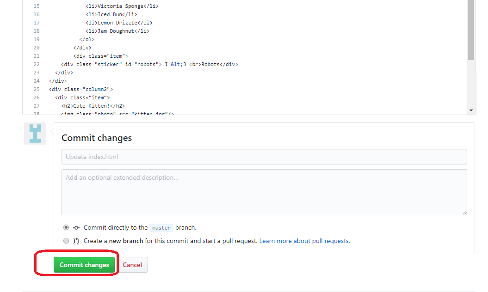

Επιστρέφουμε στην ιστοσελίδα. Μερικές φορές χρειάζεται χρόνο για να εμφανιστεί η αλλαγή. Μπορεί να χρειαστεί να πατήσουμε F5 ή Ctrl+F5 για να τη βοηθήσουμε.

Τελικά όμως θα δούμε το γλυκό που δηλώσαμε!

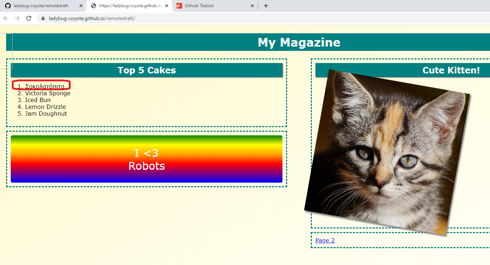

Σημείωση: Το συγκεκριμένο μάθημα έχει στηριχθεί στο παρακάτω μάθημα της Raspberry Pi Foundation
https://projects.raspberrypi.org/el-GR/projects/magazine
