# Ασκήσεις ιστοσελίδας

  
Εισαγωγή

Για να πραγματοποιήσουμε τις παρακάτω ασκήσεις, χρειάζεται πρώτα να έχουμε να έχουμε ολοκληρώσει την ιστοσελίδα του παρακάτω μαθήματος

https://github.com/ezeakis/coderdojo_votanikos_repo/blob/master/Instructions/github_webpage/github_webpage.md

Θα κάνουμε τρεις αλλαγές στη σελίδα: θα προσθέσουμε ένα έκτο γλυκό, θα αλλάξουμε τα χρώματα του banner και θα αλλάξουμε τη φωτογραφία της γάτας

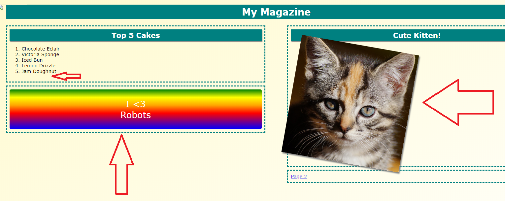

  
Προσθήκη έκτου γλυκού

Η πρώτη αλλαγή θα γίνει στο αρχείο index.html. Το επιλέγουμε.

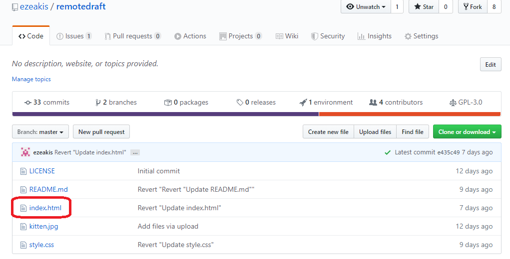

Εντοπίζουμε το σημείο που είναι τα γλυκά

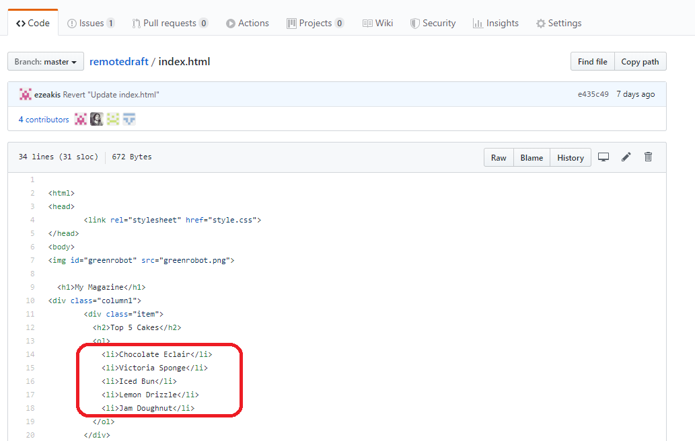

Πατάμε το edit

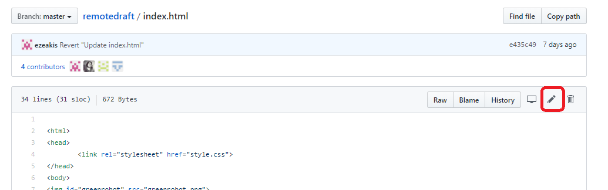

Προσθέτουμε το έκτο γλυκό

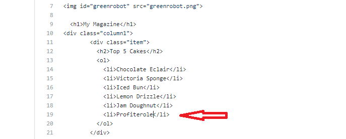

Πατάμε commit

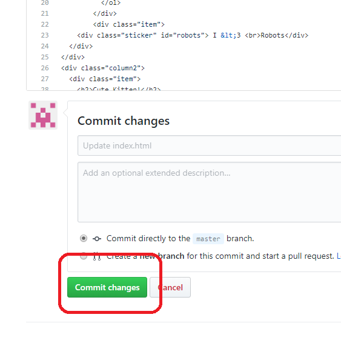

  
Αλλαγή χρωμάτων

Επιστρέφουμε στο repository

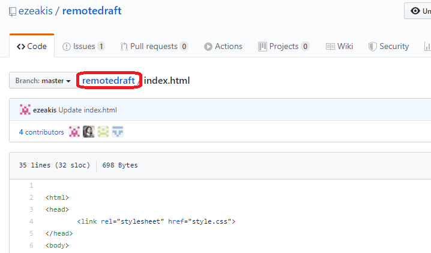

Για την επόμενη αλλαγή θα πάμε στο αρχείο style.css

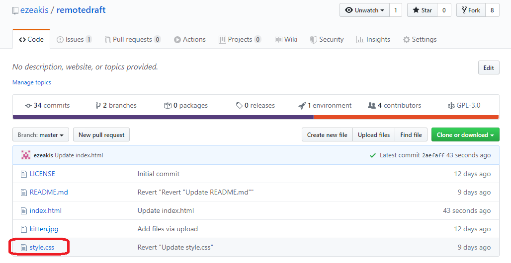

Εντοπίζουμε το σημείο που είναι τα χρώματα

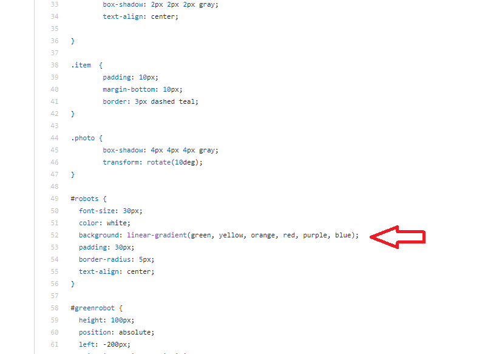

Πατάμε το edit

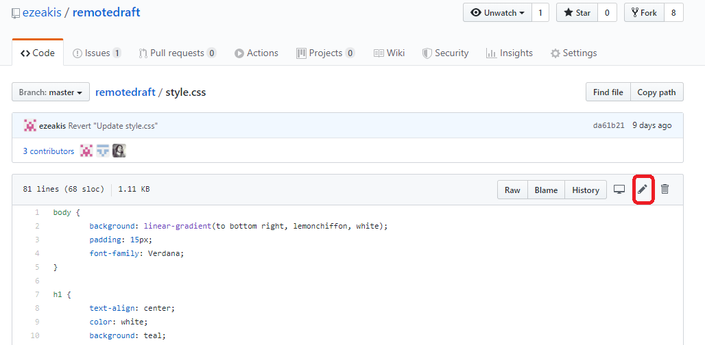

Αλλάζουμε τα χρώματα

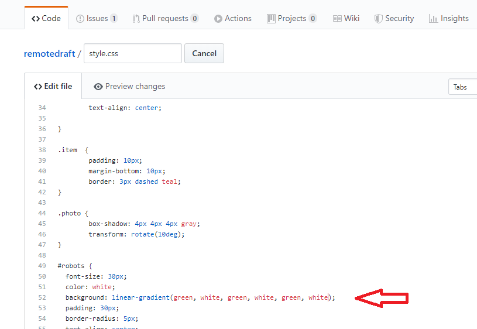

Πατάμε commit

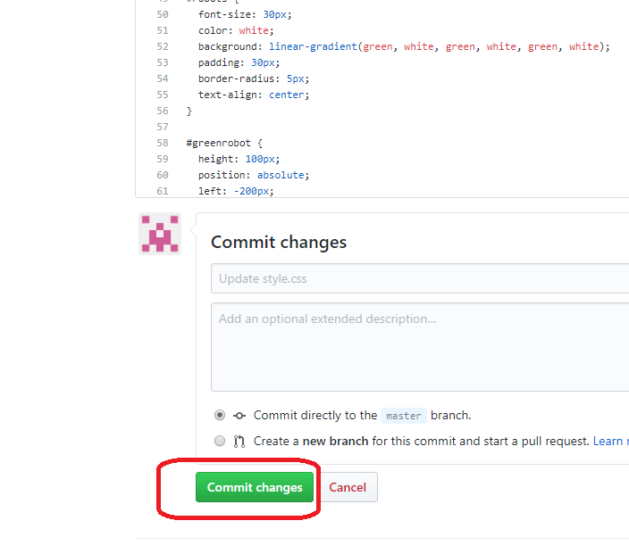

  
Αλλαγή εικόνας

Επιστρέφουμε στο repository

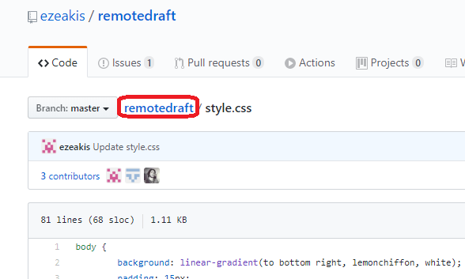

Πατάμε upload files

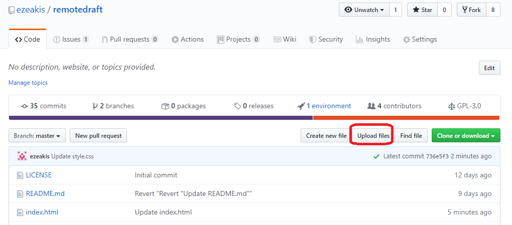

Πατάμε choose your files

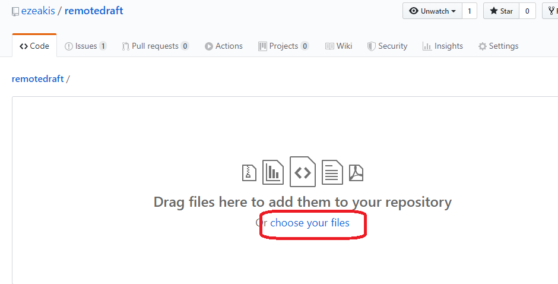

Επιλέγουμε το αρχείο που θέλουμε να χρησιμοποιήσουμε και πατάμε "άνοιγμα"

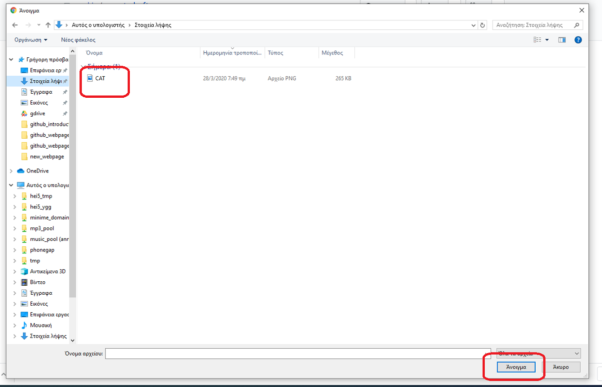

Περιμένουμε να ανέβει και μετά πατάμε commit

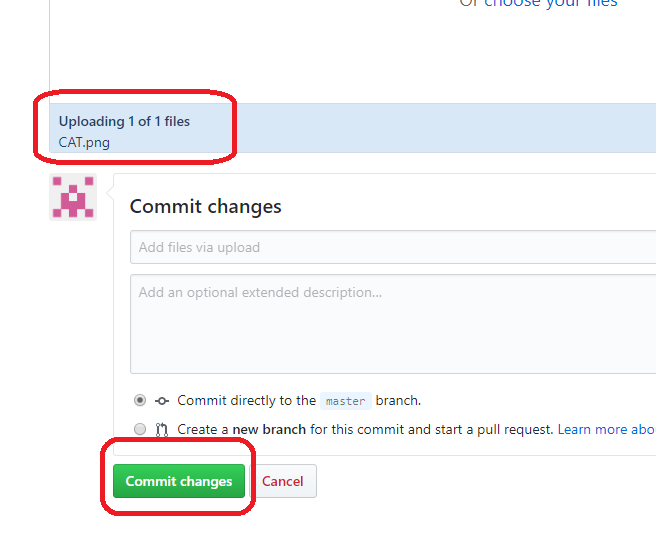

Βλέπουμε ότι τοποθετήθηκε στο repository. Σημειώνουμε το ακριβές όνομα του αρχείου (προσέχουμε και την κατάληξη και το αν είναι κεφαλαία τα γράμματα ή μικρά)

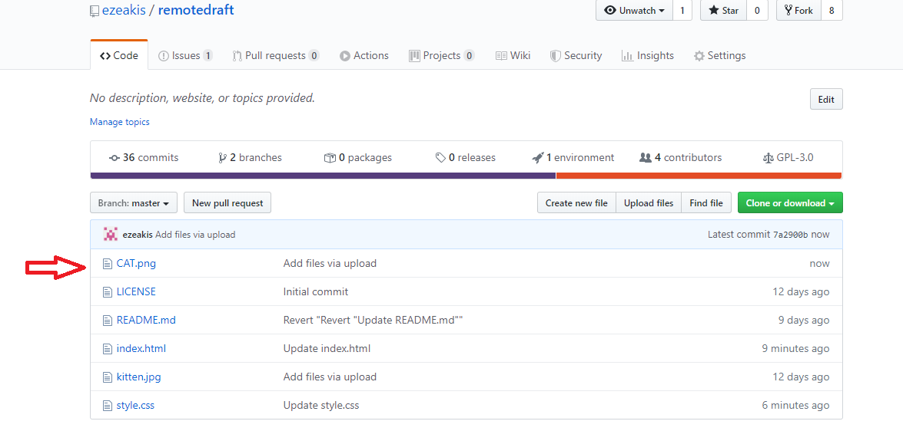

Πατάμε το index.html

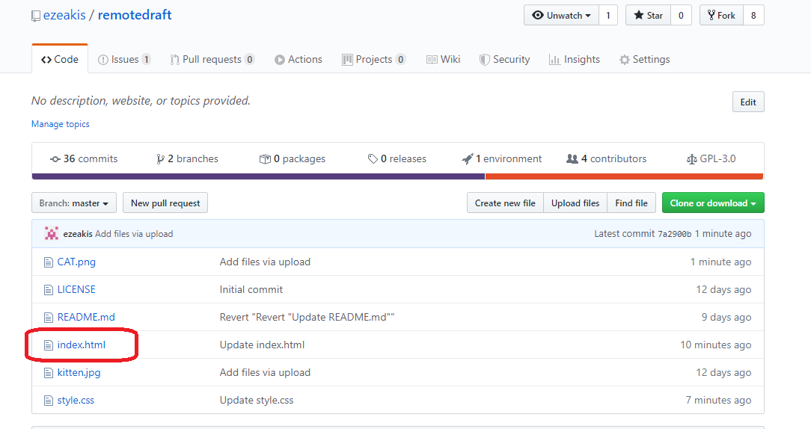

Εντοπίζουμε το σημείο στο οποίο βρίσκεται η εικόνα

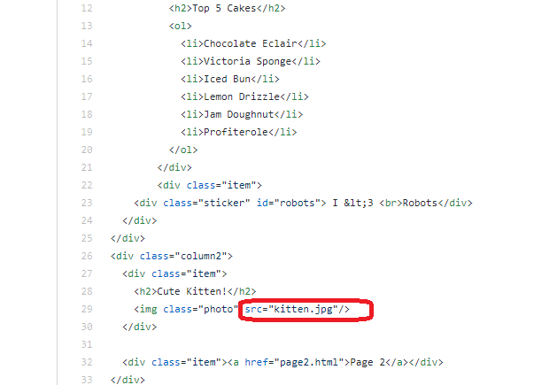

Πατάμε edit

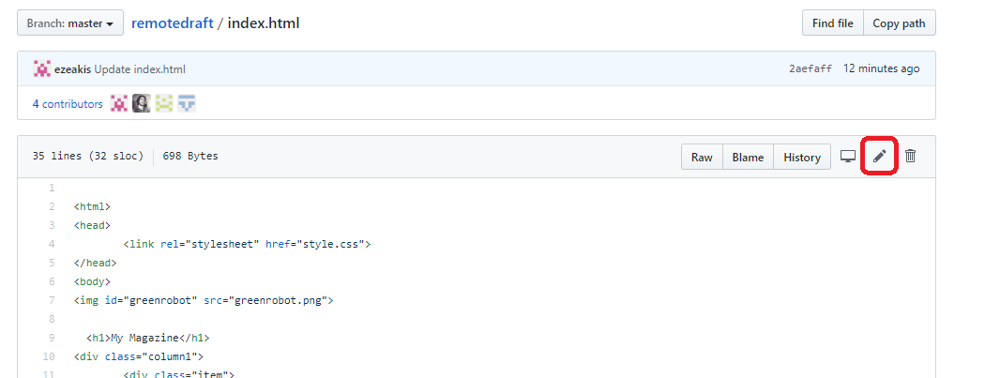

Αλλάζουμε το κείμενο της εικόνας

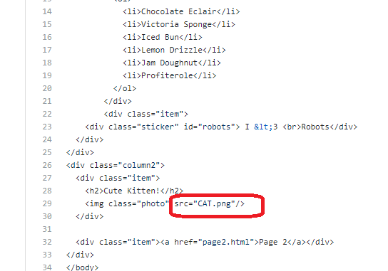

Πατάμε commit

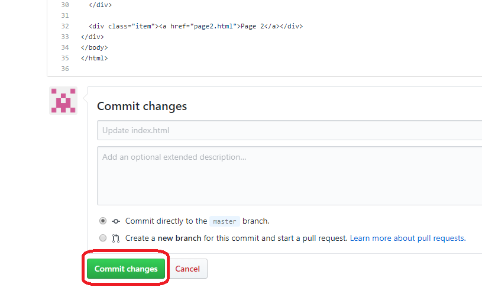

  
Τελικό αποτέλεσμα

Και οι τρεις αλλαγές μας έχουν συμβεί!

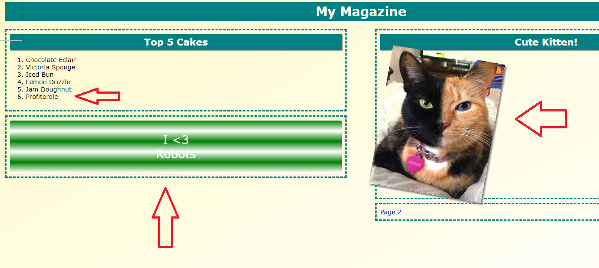

