# Δημιουργία απλής ιστοσελίδας με εικόνα και κείμενο

# Δημιουργία repository

Τον κώδικά μας στο github τον οργανώνουμε σε repositories (αποθετήρια).

Για να δημιουργήσουμε ένα καινούριο repository πατάμε "New"

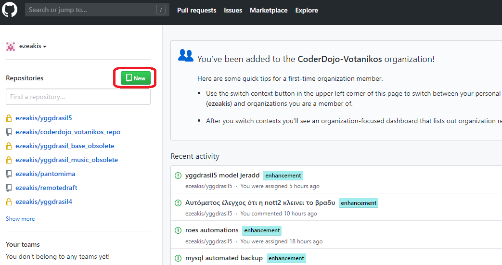

Επιλέγουμε όνομα, public (αν θέλουμε να είναι διαθέσιμο σε όλους), "Initialize this repository with a README" (για να δημιουργηθεί ένα αρχείο με οδηγίες), επιλέγουμε μία άδεια χρήσης (πχ GNU General Public License 3.0) και τέλος "Create Repository"

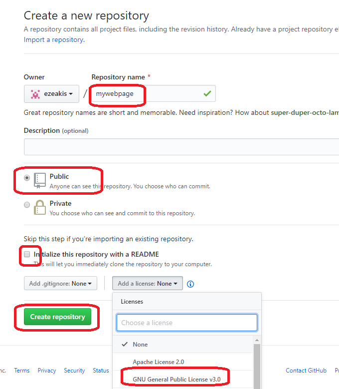

# Ανέβασμα εικόνας

Επιλέγουμε "Upload Files"

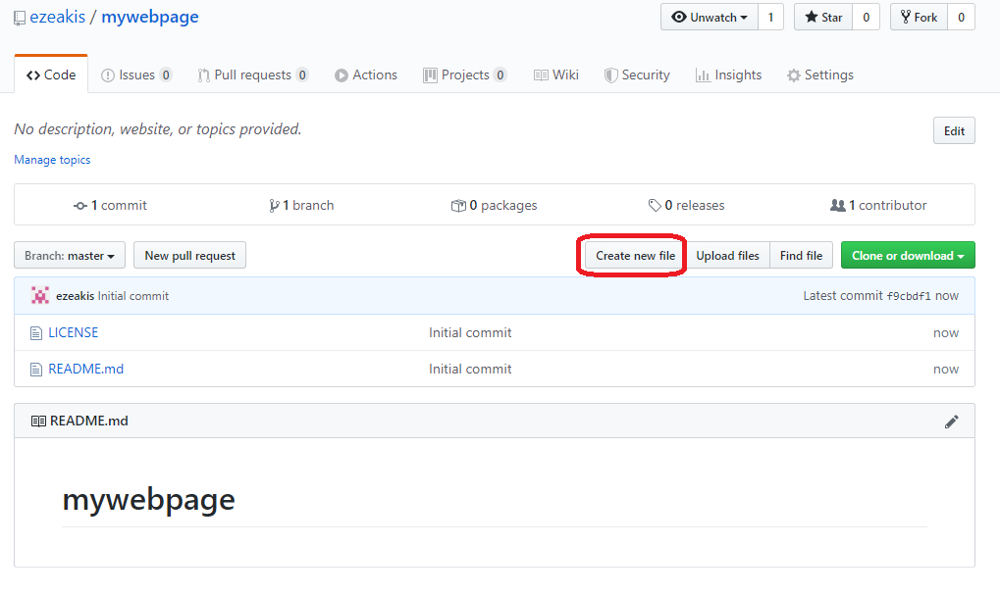

Πατάμε "choose your files"

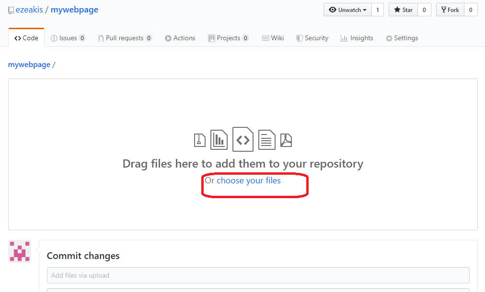

Επιλέγουμε το αρχείο και "Άνοιγμα"

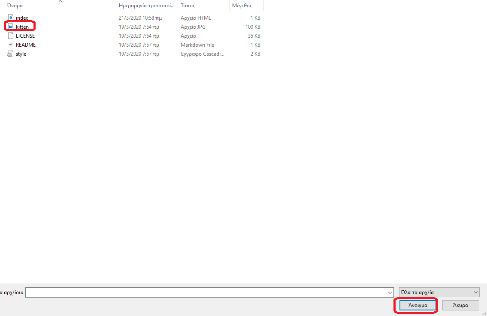

Πατάμε "Commit changes"

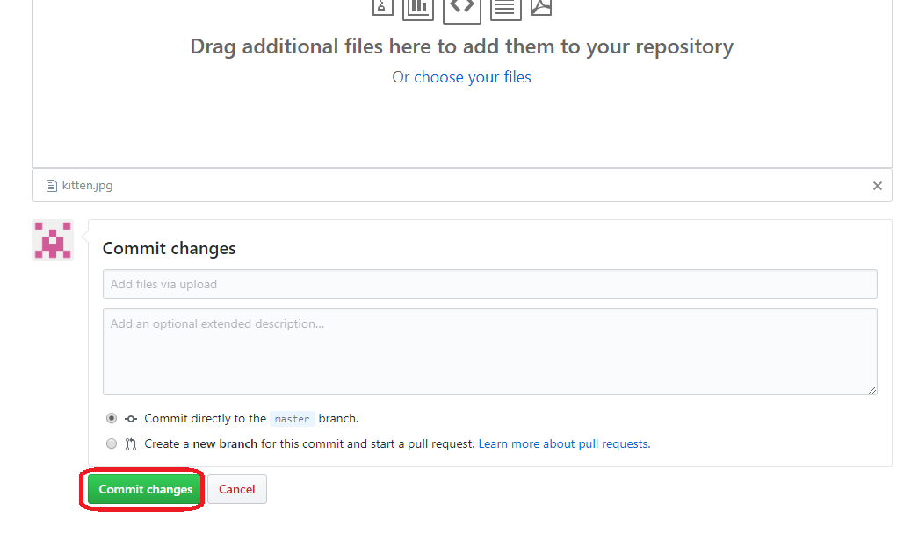

Η εικόνα μας έχει ανέβει και είναι διαθέσιμη για την ιστοσελίδα μας

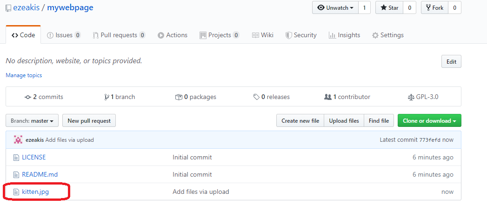

# Δημιουργία html αρχείου

Πατάμε "Create new file"

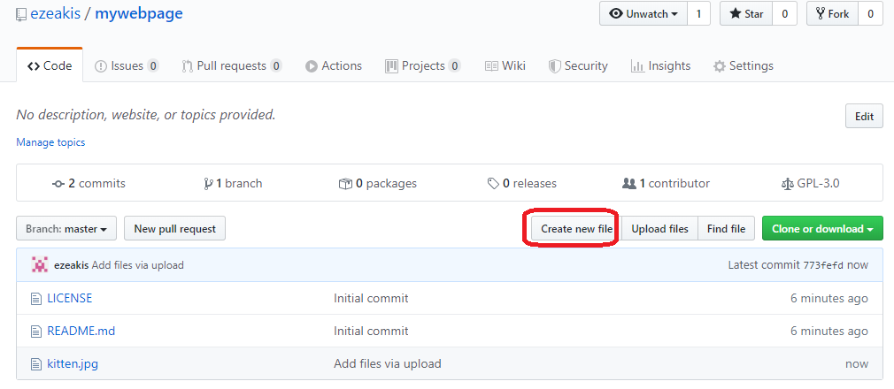

Δίνουμε το όνομα του αρχείου (index.html)

Επίσης γράφουμε τον παρακάτω βασικό html κώδικα.

Τα στοιχεία που έχουν στην αρχή και το τέλος <> ονομάζονται tags. Δίνουν οδηγίες στον browser για το πως θα φτιάξει την ιστοσελίδα.

Τα περισσότερα tags είναι σε ζευγάρια, ένα αρχής και ένα τέλους. Για παράδειγμα το αρχείο μας ξεκινάει με ένα html tag και τελειώνει σε ένα html tag.

Σε αυτόν τον κώδικα λοιπόν τα tags λένε το εξής:

*Αυτό είναι ένα html αρχείο*

*Έχει ένα μέρος στην αρχή που λέγεται head (κεφάλι) και ένα μέρος μετά που λέγεται body (σώμα)*

Σε αυτό το μάθημα θα ασχοληθούμε μόνο με το body, στο οποίο δηλώνουμε τι θα εμφανιστεί στην ιστοσελίδα.

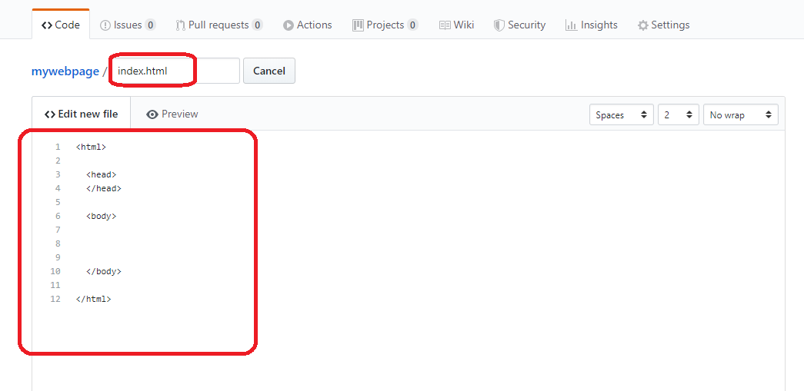

Γράφουμε τον παρακάτω κώδικα για να εμφανιστεί η εικόνα και το κείμενο.

Προσέχετε ότι υπάρχουν τρία tags

Το p tag είναι για να χωρίζει παραγράφους.

Το img tag είναι για να δηλώσουμε την εικόνα. Παρατηρήστε πώς δηλώνουμε σε αυτό το tag το όνομα της εικόνας (kitten.jpg). Επίσης παρατηρήστε ότι αυτό το tag δεν έχει ζευγάρι και είναι μόνο του.

Το h3 tag είναι για να μεγαλώσουμε λίγο τα γράμματα.

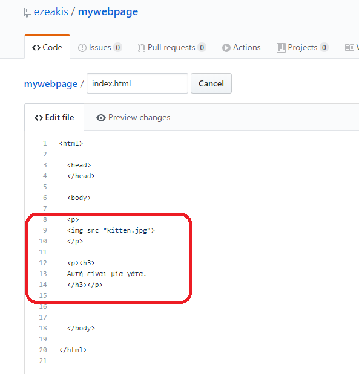

Πατήστε το "Commit Changes"

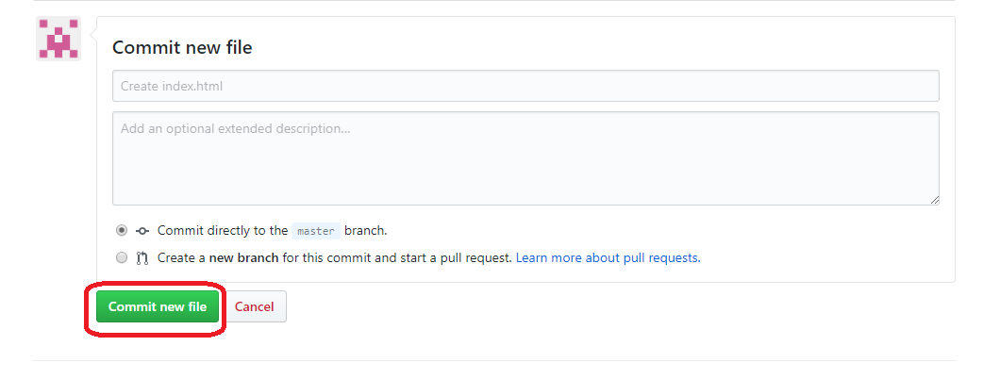

Κατόπιν θα ακολουθήσετε τις οδηγίες που αναφέρονται στο

για να ενεργοποιήσετε την ιστοσελίδα.

Και η ιστοσελίδα είναι έτοιμη. 

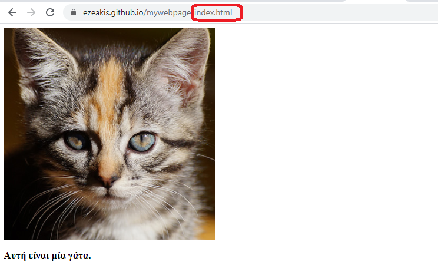

