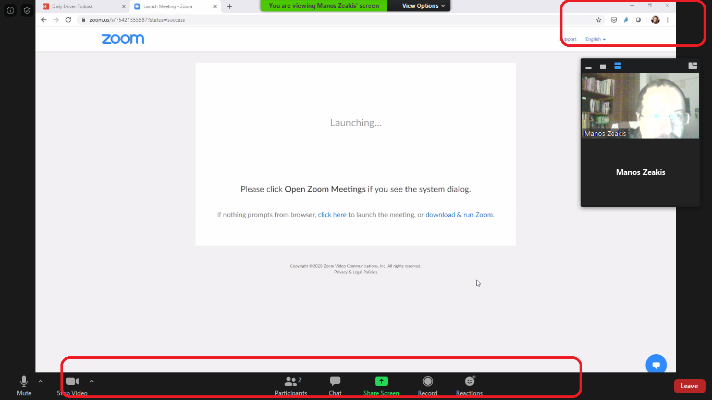
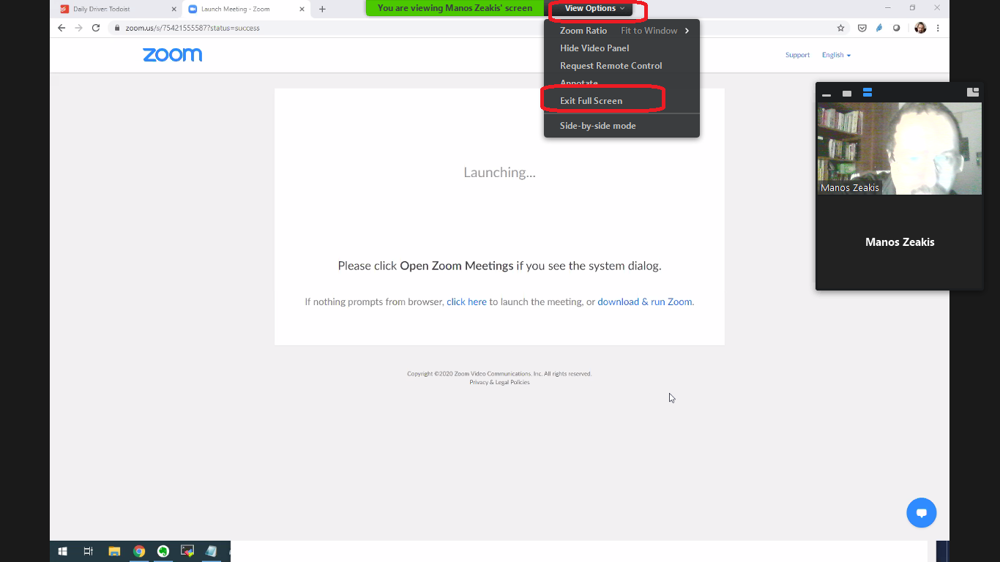
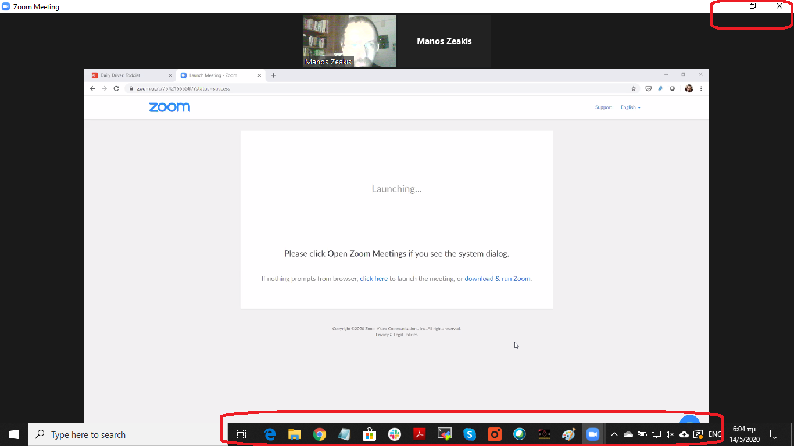

# Οδηγίες για να βγούμε από τη λειτουργία πλήρους οθόνης στο zoom

Αρκετά συχνά βρισκόμαστε σε μία κατάσταση στο zoom, όπου δεν μπορούμε να βγούμε από τη λειτουργία πλήρους οθόνης. 

Ούτε η μπάρα με τα εικονίδια στο κάτω μέρος είναι διαθέσιμη για να επιλέξουμε άλλη εφαρμογή, ούτε τα κουμπιά πάνω δεξιά ώστε να χαμηλώσουμε το παράθυρο.

Επιλέγουμε View Options και μετά Exit Full Screen

Μετά από αυτή την ενέργεια έχουμε διαθέσιμη και την μπάρα στο κάτω μέρος και τα κουμπιά στο πάνω δεξιά μέρος.

